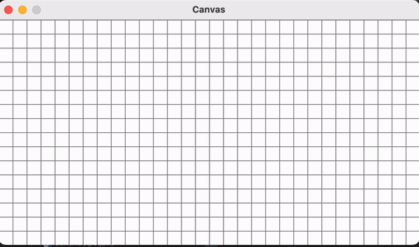

<h1 align="center"> MineSweeper</h1>

 

This is Minesweeper. This is my own take on the classic <a href="https://minesweeperonline.com"> MineSweeper</a> Game. Simply put, you start the game by running the code. Once the game has begun, click a square on the grid to either reveal a bomb, or a space. If you click on a space, the surrounding blocks may reavel how many bombs are in surrounding spaces. The objective of the game is to click all the empty spaces and <b>AVOID</b> all bombs. Customize the game board by changing the amount of bombs in the code given.

## ‼️Disclaimer‼️

This code is not to be used for college assignments. The code is uploaded to my github as part of my portfolio, but as you all know, this code may not be used as plagiarism and I do not conde any acts made through the **theft** of this code. Other than that though, enjoy!
